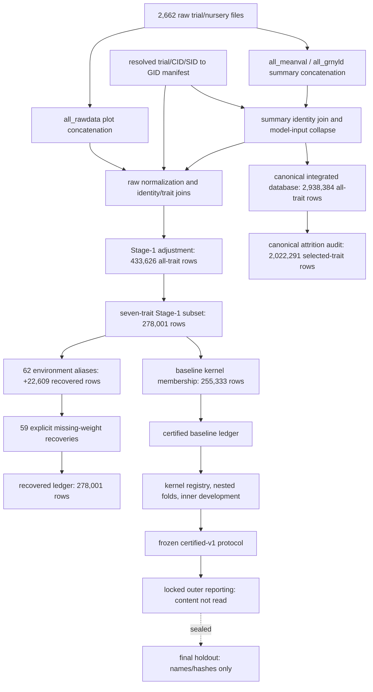

# Phase 1 project inventory and reproducibility assessment

Date: 2026-07-29
Run ID: `phase1_project_inventory_reproducibility_v1`
Repository commit: `274e41df1abbae54785f86eec709f2012efcab7b`

## Outcome

Phase 1 is complete as a diagnostic assessment. The six requested cardinalities
were independently reproduced from supplied artifacts. Raw inputs were inventoried
with fresh SHA-256 hashes. The complete test suite passes in an isolated,
GPU-enabled TensorFlow 2.15.1 environment when pandas is pinned to 2.2.3.

The certified-v1 static contract is reproducible: the frozen protocol hash, all
five bound implementation hashes, the completion code commit, and all safe entries
in the supplied completion manifest verify. Full byte-for-byte rerun
reproducibility is **not demonstrable from the server bundle** because the 15
certified expert kernel byte artifacts and trained outputs were intentionally not
supplied, the ledger lineage records `git_commit=unknown`, and no run-bound
dependency lock accompanies the certified completion. No Stage-1 build or model
training was run.

No outer-test result content was read. No final-holdout identifiers, membership,
outcomes, predictions, or summaries were read. Protected artifacts were inventoried
only by supplied path, size, and hash metadata.

The detailed metadata-only inventory classifies 27 locked outer-reporting paths,
5 explicitly named final-holdout paths, 2,116 sealed final-nested fold paths, and
8 other sealed final-nested artifact/provenance paths. The classification did not
open any listed file.

## Repository and data inventory

| Scope | Observed |
| --- | ---: |
| Repository tracked files present | 390 |
| Repository tracked files absent | 1 user-owned pre-existing deletion |
| Untracked files at initial Phase-1 inventory | 12 |
| Server bundle files/directories/bytes | 129 / 26 / 1,315,940,790 |
| Bundle manifest verification | 128/128 entries passed |
| Trial/nursery datasets/files/bytes | 207 / 2,662 / 2,289,315,075 |
| Genotypic datasets/files/bytes | 10 / 92 / 97,187,081,562 |

Fresh raw manifests agree with the prior audit inventories for all 2,754 files by
relative path, byte size, and SHA-256. The final before/after comparison is recorded
in the Phase-1 output root and is a mandatory zero-change gate.

The server bundle is traceable to a clean detached worktree at the same commit as
the local repository. The empty `server_source_snapshot` is therefore expected.
The self-check message in `bundle_transfer.log` was caused by that log changing
while the bundle was being hashed; an independent verification of the completed
manifest passed all entries.

## Expected versus observed counts

| Metric | Expected | Observed | Status |
| --- | ---: | ---: | --- |
| Canonical records for the seven selected traits | 2,022,291 | 2,022,291 | PASS |
| Stage-1 selected-trait observations | 278,001 | 278,001 | PASS |
| Stage-1 genotypes | 5,253 | 5,253 | PASS |
| Stage-1 environments | 1,015 | 1,015 | PASS |
| Recovered environment-alias rows | 22,609 | 22,609 | PASS |
| Fold-local weight-recovery rows | 59 | 59 | PASS |

The selected traits are `1000_GRAIN_WEIGHT`, `ABOVE_GROUND_BIOMASS`,
`DAYS_TO_HEADING`, `DAYS_TO_MATURITY`, `GRAIN_YIELD`, `PLANT_HEIGHT`, and
`TEST_WEIGHT`.

Important supporting counts:

- 6,655,264 summary input rows became 3,084,643 resolved numeric rows and
  2,938,384 collapsed canonical-input rows across all traits.
- The canonical database contains 2,938,384 rows, 12,420 GIDs, 7,378
  environments, and 126 traits. Only 406,480 rows have raw-plot support;
  2,531,904 are summary-only.
- Stage 1 begins from a parallel raw-plot branch: 581,397 eligible numeric raw
  records became 433,626 adjusted rows across all traits, including 99 fallback
  adjustments.
- The seven-trait subset contains 278,001 rows. The original baseline model-ready
  subset retains 255,333: 14,162 rows fail genotype-order membership, 8,447 fail
  environment-order membership, and 59 have invalid/nonpositive source weights.
  Those categories partition the 278,001 rows exactly.
- Sixty-two accepted environment aliases restore 22,609 rows, including four
  aliases requiring collision resolution. The final alias artifact has 1,015
  environments. An earlier logged attempt recovered only 22,409 rows and 1,014
  environments because whitespace normalization was incomplete; it failed its
  intended validation and is not the delivered artifact.
- All 59 weight-recovery rows lack finite positive source variance. They are
  retained as explicit recovery cases; any variance/weight imputation must be fit
  inside each inner training fold. The recovered uniform-weight ledger includes all
  278,001 observations and retains original variance metadata.

## Pipeline dependency map

The exact machine-readable maps are `pipeline_dependency_map.tsv` and
`transformation_join_map.tsv` in the versioned output root.

## Material transformations and joins

The audit located 13 material transformations/joins. The highest-risk findings are:

1. `build_baseline.py` discovers source tables by scanning the repository
   recursively, rather than using an explicit hash-bound raw-root allowlist. This
   workspace also contains duplicate-looking top-level trial directories.
2. `phenotypes/model_input_phenotypes.tsv` is produced by
   `build_next_integration_layer.py::build_collapsed_modeling_phenotypes`, not by
   `build_baseline.py` as stated in the older lineage note.
3. The identity lookup sorts then uses `drop_duplicates(..., keep="first")` for
   trial/CID/SID keys. It does not emit an ambiguity queue.
4. Summary identity, panel, raw-support, Stage-1 identity, and trait-map joins omit
   explicit `validate=` cardinality checks and row-level join ledgers.
5. Model-input and Stage-1 filters record aggregate counts but not a terminal state
   for every discarded source observation.
6. Canonical and Stage 1 are parallel branches at different biological grains.
   The 2,022,291 canonical count is not directly filtered into 278,001 Stage-1
   rows.
7. `raw_plot_support.parquet` may be reused because it exists, without checking an
   input-manifest hash.
8. Core builders target fixed paths and may replace prior outputs; Phase 2 must
   wrap or refactor them into fail-if-exists versioned paths.
9. Ledger-to-compact-order index mapping is fail-closed, but the certified and
   recovered ledger lineage JSON files do not record their producing Git commits.

## Reproducibility assessment

### Verified

- Frozen protocol SHA-256:
  `251ab22231e7a8c7f3cfb5bfd8721b7e2054057a21ac77109813b8aec640ab9b`.
- All five protocol-bound implementation hashes match current canonical-LF bytes.
- Completion code commit `98fba61816bfc3c2da6af1b6d99fc4a4ff947e1f` exists in Git history.
- Relevant implementation files are unchanged between that commit and current
  HEAD.
- All safe completion-manifest entries supplied in the bundle exist and hash-match.
- Certified kernel certification metadata reports 180 checks and zero failures,
  with the ledger and 15 kernel/order hashes recorded.

### Not demonstrable in Phase 1

- Zero of the 15 certified expert kernel byte artifacts were supplied for an
  independent byte comparison.
- Trained model/output bytes are absent locally and omitted from the bundle.
- No dependency lock is cryptographically bound to the completed certified run.
- Certified and recovered ledger lineage record `git_commit=unknown`.
- A full rerun would train models and use protected folds/results, which is outside
  Phase 1 and was not attempted.

Conclusion:
`PARTIALLY_REPRODUCIBLE_STATIC_CONTRACT_FULL_BYTE_REPRODUCTION_NOT_DEMONSTRABLE_FROM_BUNDLE`.

## Environment and tests

The selected execution environment is WSL2 Debian 13, Python 3.11.15,
TensorFlow 2.15.1, CUDA 12.2, and cuDNN 8. The RTX 3050 Ti (compute capability
8.6) was enumerated and executed a GPU matrix multiplication successfully. The
duplicate plugin-registration, NUMA, and missing-TensorRT messages are non-fatal.

Test results:

- Server-matched dependency behavior with pandas 3.0.3: 449 passed, 2 failed.
  Both failures are pandas-compatibility defects, not TensorFlow/GPU failures.
- Isolated clone with pandas 2.2.3: targeted regressions 2/2 passed; full suite
  451/451 passed.
- The declared range `pandas>=2.1` is too broad for current tests. Phase 2 should
  pin pandas 2.2.3 (or deliberately make the code pandas-3 compatible before
  changing that pin) and bind a complete lock.

The exhaustive dependency versions are in the two lock files in the Phase-1
output root. A native-Windows installation attempt was abandoned because
`pyBigWig` lacks the needed Windows wheel and modern TensorFlow CUDA execution is
supported through WSL2 rather than native Windows.

## Prioritized Stage-1 audit plan (Phase 2)

1. Freeze a versioned Stage-1 audit protocol, explicit input hashes, source-root
   allowlist, and protected-path denylist.
2. Build a source-row registry accounting for all 2,662 trial files with original
   file, workbook sheet/archive member, and row provenance.
3. Rebuild identity and trait registries without keep-first adjudication; emit
   ambiguity/conflict queues and enforce cardinalities.
4. Replay raw normalization and Stage-1 grouping into a new output root, creating a
   row-level terminal-state ledger and many-to-one contribution map.
5. Audit fixed-effect specifications, fallback causes, variance/weight semantics,
   and trait/environment support without using protected results.
6. Replay alias and kernel membership joins and verify exactly 22,609 alias rows
   plus 59 training-only weight cases.
7. Compare the versioned audit to frozen-v1 counts/hashes without modifying v1;
   explain every difference and prove raw before/after hashes are identical.
8. Update handoffs and stop before candidate model training.

Phase 2 must not rebuild the certified artifact in place, train candidate models,
open outer-test contents, or inspect the final holdout.

## Files and evidence

All Phase-1 artifacts live under
`audit/v2/phase1_project_inventory_reproducibility_v1/`. Important tables are:

- `trial_file_inventory_before.tsv`, `genotype_file_inventory_before.tsv`, and
  matching after-snapshots;
- `repository_file_inventory.tsv`, `repository_file_inventory_after.tsv`, and
  `server_bundle_inventory.tsv`;
- `expected_vs_observed_counts.tsv` and `direct_artifact_counts.tsv`;
- `pipeline_dependency_map.tsv` and `transformation_join_map.tsv`;
- `probable_attrition_points.tsv` and `phase2_implementation_plan.tsv`;
- `reproducibility_checks.tsv` and `reproducibility_assessment.json`;
- `protected_artifact_inventory.tsv` and its more detailed access-class view
  `protected_artifact_inventory_detailed.tsv`, containing metadata only;
- environment, dependency, test, and command records.

Scripts added under `scripts/v2/` are diagnostic and write only to new versioned
paths. No commit or push was made.

## Stop condition

Phase 1 ends here. The exact recommended next phase is **Phase 2 — versioned
Stage-1 lineage, transformation, and leakage audit**, beginning with P2.0 contract
freeze and stopping after its review package. It requires user review/authorization
before execution.
