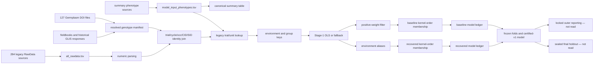

# Phase 2 forensic Stage-1 attrition audit

Run ID: `phase2_stage1_lineage_audit_v1`
Date: 2026-07-29
Status: diagnostic work complete; stopped for human review
Evidence root: `audit/v2/phase2_stage1_lineage_audit_v1/`

## Outcome

The legacy Stage-1 path is exactly reconstructed at the identity and contribution
levels without rebuilding or modifying Stage 1. The local raw input yields all
433,626 supplied server Stage-1 IDs, with zero missing IDs and zero
`n_plot_records` mismatches. The seven selected traits yield 278,001 Stage-1
observations, 5,253 GIDs, and 1,015 environments.

Every one of the 2,938,384 canonical rows now has a unique permanent
`canonical_row_id` and a final disposition. Every one of the 7,836,162 legacy raw
rows has a collision-free `RAW2_` ID and an explicit final raw disposition in the
final ledger. Canonical and Stage 1 are confirmed parallel summary/raw branches;
their totals must not be presented as one linear filter waterfall.

No Stage-1 artifact was rebuilt, no model was trained, and no production,
certified-v1, raw, kernel, fold, or reporting artifact was modified. Outer-test
content was not read or used. The final holdout remained sealed.

## Frozen inputs and environment

The diagnostic protocol binds the repository commit, exact input paths, byte
sizes, SHA-256 hashes, seven traits, protected-path denylist, ID policy, and the
WSL environment. Protocol amendment 001 corrects a raw-ID collision discovered by
the mandatory uniqueness check; the provisional ledger remains unchanged.

- Git commit: `274e41df1abbae54785f86eec709f2012efcab7b`
- Environment: WSL2 Debian, Python 3.11.15, pandas 2.2.3, TensorFlow 2.15.1
- Dependency lock: Phase-1 `dependencies_wsl_tf215_gpu_pandas22.lock.txt`
- New dependencies: none
- Raw immutability: 2,662/2,662 trial files and 92/92 genotype files match the
  Phase-1 baseline by path, size, and SHA-256

## Pipeline dependency map

The exact tabular map with producer, inputs, operation, output grain, and finding is
`closure_v2/pipeline_dependency_map_final.tsv`.

## Expected versus observed counts

| Metric | Expected | Observed | Status |
| --- | ---: | ---: | --- |
| Legacy raw rows | 7,836,162 | 7,836,162 | PASS |
| Numeric raw rows | 7,273,254 | 7,273,254 | PASS |
| Identity-eligible Stage-1 contributors | 581,397 | 581,397 | PASS |
| All-trait Stage-1 rows | 433,626 | 433,626 | PASS |
| Selected-trait Stage-1 rows | 278,001 | 278,001 | PASS |
| All canonical rows | 2,938,384 | 2,938,384 | PASS |
| Selected canonical rows | 2,022,291 | 2,022,291 | PASS |
| Distinct permanent canonical IDs | 2,938,384 | 2,938,384 | PASS |
| Distinct final raw IDs | 7,836,162 | 7,836,162 | PASS |
| Reconstructed Stage-1 IDs | 433,626 | 433,626 | PASS |
| Stage-1 contributor-count mismatches | 0 | 0 | PASS |
| Local DOI files parsed | 127 | 127 | PASS |
| Raw files unchanged | 2,754 | 2,754 | PASS |

The machine-readable table is
`closure_v2/phase2_expected_vs_observed_counts.tsv`.

## Attrition waterfalls

### Legacy raw to Stage 1

| Step | Rows | Loss/change | Interpretation |
| --- | ---: | ---: | --- |
| Concatenated legacy raw | 7,836,162 | — | 284 contributing RawData files |
| Numeric parse passed | 7,273,254 | -562,908 | 555,238 textual/blank missing; 7,670 other nonnumeric tokens |
| GID resolved after manifest/raw fallback | 581,397 | -6,691,857 | Fail-closed legacy identity exclusion |
| Contributing rows | 581,397 | 0 | All eligible rows map to a supplied Stage-1 output |
| Stage-1 adjusted outputs | 433,626 | -147,771 | Many-to-one adjustment, exactly reconciled by `n_plot_records` |

### Selected Stage 1 to model-ready inputs

| Step | Rows | Loss/change |
| --- | ---: | ---: |
| Selected Stage 1 | 278,001 | — |
| Baseline model ready | 255,333 | -22,668 |
| Alias-only with positive weight | 277,942 | -59 |
| Alias plus fold-local weight registry | 278,001 | 0 |

Baseline loss partitions into 14,162 genotype-order rows, 8,447 environment-order
rows, and 59 invalid/nonpositive-weight rows. All selected Stage-1 rows, including
the excluded groups, have both pedigree and marker support; the 14,162 are an
order-registry mismatch, not biological modality absence.

### Canonical parallel branch

The canonical table has 2,938,384 rows: 2,531,904 summary-level rows that are not
raw Stage-1 inputs, 371,448 rows sharing a Stage-1 natural key, and 924 raw-linked
rows with no numeric raw Stage-1 input. Among the selected traits, 277,998
canonical rows share a Stage-1 natural key. Three selected GRAIN_YIELD Stage-1 rows
have no canonical natural-key counterpart and remain a review item.

The finalized canonical dispositions are:

| Disposition | Canonical rows |
| --- | ---: |
| Summary-level parallel branch | 2,531,904 |
| Selected retained in baseline | 255,330 |
| Stage 1 retained outside seven traits | 93,450 |
| Raw-linked unit mismatch | 34,108 |
| Selected genotype-order exclusion | 14,162 |
| Selected environment-order exclusion | 8,447 |
| No numeric raw Stage-1 input | 924 |
| Selected invalid weight, recovered fold-locally | 59 |

## DOI/GLIS identity path

The user clarification that some GIDs came from local `Germplasm_DOIs` files was
material and was incorporated before closure. No live GLIS query was made.

- 127 local DOI CSV/TAB files parse successfully: 13,569 records, including
  13,410 syntactically valid DOI values and 159 non-DOI text placeholders.
- Only 55 of those 127 files occur in the supplied manifest's exact DOI-file
  linkage; 7,413 local DOI records lack an exact file/CID/SID manifest match.
- The manifest contains 6,255 syntactically valid DOI rows, 5,905 GLIS GIDs, and
  484 rows whose chosen source is `glis_doi_resolver`.
- Those 484 rows contribute 3,219 raw inputs to 3,005 Stage-1 observations; 1,559
  of the Stage-1 observations belong to the selected seven traits.
- The exact producer named in lineage documentation, `resolve_all_trial_gids.py`,
  is absent from the repository/bundle, so GLIS response acquisition and parsing
  cannot be reproduced from code.
- The legacy identity join requires trial, cycle, occurrence, CID, and SID. There
  are 1,530,430 excluded numeric rows in 271,516 raw environment/key groups with a
  unique syntactically valid-DOI GID at the same trial/cycle/CID/SID when only
  occurrence is relaxed. None requires relaxing cycle. This strongly indicates
  an over-specific identity join, but Phase 2 does not apply the recovery.
- Ninety-five valid DOI values are associated with multiple resolved GIDs in the
  manifest. Ninety manifest rows explicitly flag fieldbook-versus-GLIS conflict;
  none reaches Stage 1 through an exact legacy key in the present inputs.

The occurrence scope, 72 unrepresented DOI files, missing resolver provenance,
and DOI-to-GID conflicts are P0 review items. The candidate ledger is evidence,
not an accepted alias registry.

## Join cardinality findings

The original Stage-1 identity and trait merges are literal left joins; no literal
inner-join loss was found. Equivalent silent loss occurs through filters after the
joins:

- Numeric parse failures are removed immediately.
- Unresolved GIDs are removed after the left identity join.
- Trait mappings are keep-first; unmatched traits fall back to the normalized raw
  label rather than being removed.
- Positive-weight filtering occurs before environment aliases in baseline kernel
  preparation.
- Kernel membership removes non-members after lookups.

The raw-to-Stage-1 contribution join is exact: 581,397/581,397 contributors match
433,626 unique supplied outputs. The selected Stage-1-to-baseline attrition ledger
is exact 1:1; alias-plus-weight model input is exact 1:1. The final join report also
records the DOI-file and occurrence-relaxed diagnostic joins.

## Confirmed defects and policy gaps

The final machine-readable register contains 25 findings, including negative
findings. The principal confirmed defects are:

1. No original member/sheet/physical row persisted by legacy concatenation.
2. 562,908 numeric parse failures were filtered without a source-row exclusion
   ledger.
3. Resolver and trait registries use keep-first policies rather than reject
   incompatible duplicate keys.
4. Trait/unit ambiguity reaches 49,781 Stage-1 input rows; 35,381 mapped-unit
   overrides disagree with the raw unit. The affected traits are outside the
   selected seven but block a safe all-trait rebuild.
5. 10,494 plot-key duplicate groups contain 35,808 rows and 25,314 excess rows;
   7,189 groups contain conflicting value tokens.
6. Environment alias resolution occurs after a membership path that loses rows;
   62 aliases recover 22,609 observations. Four collision decisions affect 1,271.
7. Weight filtering removes 59 outcomes before fold-local recovery.
8. Repository-wide discovery, existence-based cache reuse, and fixed output paths
   are not reproducible or fail-safe.
9. Canonical and Stage 1 lack a persisted contribution bridge.
10. Genotype-order membership removes 14,162 fully pedigree-and-marker-supported
    observations.
11. The DOI/GLIS resolver producer is missing, occurrence is over-specific in the
    identity key, DOI source coverage is incomplete, and 95 DOI-to-GID conflicts
    require adjudication.

Negative findings are equally explicit: zero eligible Stage-1 rows have incomplete
trial/cycle/occurrence/location components; no literal inner join, outlier filter,
selected-trait zero/sentinel, alternate-GID recovery, or wide phenotype omission
was confirmed. The ignored numeric columns are auxiliary identifiers/row metadata
(`Trait_No`, `Gen_no`, `Entry`, `GID`, `Plot`, and variants), not phenotype fields.

## Numeric, zero, missing, unit, duplicate, and aggregation audit

- Numeric failure: 555,238 recognized textual/blank missing tokens and 7,670
  unrecognized categorical/malformed tokens across 46 token values.
- Zero/sentinel: 55,878 eligible all-trait rows are zero or a numeric sentinel and
  require trait rules; none belongs to a selected-trait Stage-1 contributor.
- Unit ambiguity: seven nonselected canonical traits include spreadsheet-like
  `5-Jan` or `10-Jan` unit labels mapped to `1-5` or `1-10`.
- Duplicate collapse: no explicit raw deduplication occurs before Stage-1 fitting;
  duplicate plot rows enter OLS/fallback groups. Summary construction separately
  mean-collapses 57,310 duplicates before canonical construction.
- Premature aggregation: summary aggregation supplies the trait/unit registry used
  by the raw Stage-1 branch, coupling two otherwise parallel paths.
- Outliers: no legacy outlier removal code or exclusion ledger was found because
  no outlier filter is applied.

## Permanent row ledgers

Canonical ledger:
`refinement_v2/canonical_row_disposition_ledger_final.parquet`.
It contains 2,938,384 rows, 2,938,384 distinct permanent IDs, the original
canonical identifier, natural key, Stage-1 match, model membership, alias/weight
states, nonmatch reason, and final disposition.

Final raw ledger:
`identity_amendment_v1/raw_row_disposition_ledger_final.parquet`.
It contains 7,836,162 rows and 7,836,162 distinct IDs. Its ID is based on logical
source path, source SHA-256, member/sheet, and physical row. The provisional
hash/member/row-only ID collided for 141,944 IDs because byte-identical files share
those fields; protocol amendment 001 records the correction.

Attrition summaries by source file, trial, cycle, occurrence, trait, environment,
genotype-ID class, and transformation step are in
`refinement_v2/attrition_by_dimension_final.tsv`. Detailed DOI, duplicate,
unit, parsing, alias, genotype-modality, and environment-key tables remain linked
from the final review register.

## Legitimate exclusion categories

- A recognized blank/textual missing phenotype can be excluded from numerical
  fitting only while its raw row and token remain in the ledger.
- Unrecognized nonnumeric tokens require human/source review.
- Unresolved identity is a fail-closed state, not proof that the phenotype is
  biologically unusable.
- The reduction from 581,397 contributing rows to 433,626 Stage-1 rows is a valid
  many-to-one adjustment only because every contributor and `n_plot_records`
  count reconciles.
- Trait-scope exclusion is model-specific; the all-trait Stage-1 rows remain.
- Invalid weight is not a phenotype exclusion.
- Pedigree/marker absence and outlier removal account for zero legacy Stage-1
  exclusions in this audit.

The exact classification table is
`closure_v2/legitimate_exclusion_categories_final.tsv`.

## Reproducibility assessment

The supplied Stage-1 artifact is reproducible from local inputs at the ID,
grouping, contributor-count, selected-count, genotype-count, and environment-count
levels. Byte-for-byte Stage-1 value reproduction was intentionally not attempted,
because Phase 2 prohibited rebuilding Stage 1. Full end-to-end v1 reproduction
remains unproven: the DOI/GLIS manifest producer and immutable GLIS response
provenance are missing, and Phase 1 already established that certified kernel and
trained bytes plus a run-bound v1 dependency lock were not supplied.

## Tests and validation

- Phase-2 deterministic tests: 6 passed.
- Raw-to-Stage-1 reconciliation: passed, zero ID/count mismatches.
- Raw permanent-ID uniqueness: passed after protocol amendment, zero duplicates.
- Canonical permanent-ID uniqueness: passed, zero duplicates.
- DOI files: 127/127 parsed; no live GLIS query.
- Raw before/after immutability: 2,754/2,754 matched.
- Protected-access assertions: all false; no Stage-1 rebuild or model training.
- Complete pandas-2.2.3 repository suite: 457 passed in 79.33 seconds; log at
  `logs/full_pytest_pandas22_final.txt`.

## Files created or modified

Added diagnostic scripts:

- `scripts/v2/phase2_forensic_stage1_audit.py`
- `scripts/v2/phase2_finalize_findings.py`
- `scripts/v2/phase2_verify_raw_immutability.py`
- `scripts/v2/phase2_correct_raw_row_ids.py`
- `scripts/v2/phase2_audit_doi_glis_identity.py`
- `scripts/v2/phase2_build_closure_tables.py`
- `scripts/v2/phase2_finalize_manifest.py`
- `scripts/v2/phase2_rehash_deliverables.py`
- `tests/test_phase2_stage1_forensic.py`

Added this report, the exact rebuild specification, updated all six persistent
handoffs, and created versioned evidence under the Phase-2 root. No commit or push
was performed. The pre-existing user deletion and fetch scripts remain untouched.

## Failures and corrected diagnostic iterations

- The first findings finalizer lacked the repository path on direct execution;
  this was corrected without changing source data.
- Its second attempt grouped the disposition column twice; the corrected outputs
  were written to `refinement_v2`, leaving partial attempts and logs intact.
- The provisional raw ID collided on byte-identical sources. The final ledger and
  protocol amendment correct it; the provisional artifact remains evidence.
- The first DOI candidate pass treated a nonblank placeholder as a DOI; v2 added
  DOI syntax validation, and v3 separated occurrence-only from cycle-plus-
  occurrence relaxation. `doi_glis_audit_v3` is final.

No failure altered certified, production, or raw artifacts.

## Exact recommended next phase

Stop here for review. The next phase should be **Phase 3 — Stage-1 identity,
trait/unit, and duplicate adjudication**, not model development and not an
immediate production rebuild.

Phase 3 must first obtain explicit decisions for:

1. Whether valid trial/cycle/CID/SID DOI identity is trial-wide across occurrence.
2. The 72 DOI files absent from exact manifest linkage and the 95 DOI-to-GID
   conflicts.
3. Recovery of the exact DOI/GLIS resolver code and immutable response provenance.
4. Trait/unit conversion rules for the seven ambiguous nonselected traits.
5. Conflicting plot duplicate semantics and the four environment-alias collision
   decisions.
6. The three selected Stage-1 rows without canonical natural keys.

After those decisions are frozen, implement the new versioned registries and run
the approved `stage1_rebuild_specification_v1`. Do not begin candidate training,
open outer results, or open the final holdout.
